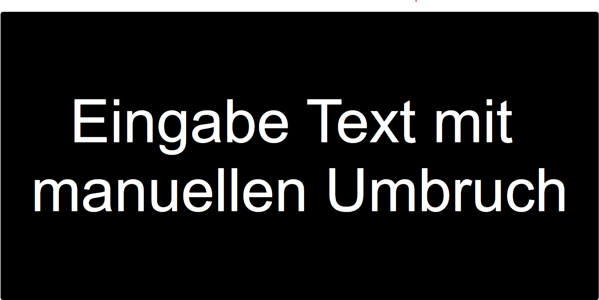

# 📖 **Choranzeige – Dokumentation**

## ✅ **Übersicht**
Die Choranzeige-Anwendung ist ein **Vollbild-Webtool**, das einen großen, editierbaren Text in der Mitte des Bildschirms anzeigt.  
Wenn kein Text eingegeben ist, wird **eine Uhr** angezeigt.  
Hauptmerkmale:

- Dynamische Anpassung der Schriftgröße an den verfügbaren Platz
- Kein automatischer Zeilenumbruch (nur bei Enter)
- Uhranzeige mit blinkendem Doppelpunkt
- Cursor und Mauszeiger ausgeblendet
- Text nicht markierbar, Eingabe nur am Ende des Textes möglich


---

## 🖼 **Screenshots**

### **Startansicht (mit Uhr)**


### **Mit eingegebenem Text**


---

## 🔍 **HTML-Struktur**

```html
<div id="container">
    <div id="editableText" contenteditable="true" spellcheck="false"></div>
</div>
<div id="clock">
    <span id="hours">--</span><span id="colon" class="blink">:</span><span id="minutes">--</span>
</div>
```

**Beschreibung:**
- `#container`: zentriert den Text
- `#editableText`: editierbarer Bereich für Textanzeige
- `#clock`: zeigt die Uhr an, wenn kein Text vorhanden ist

---

## 🎨 **CSS-Funktionen**

```css
html, body {
    margin: 0;
    padding: 0;
    height: 100%;
    background-color: black;
    color: white;
    font-family: Arial, sans-serif;
    overflow: hidden;
    cursor: none; /* Mauszeiger unsichtbar */
}

#editableText {
    display: inline-block;
    color: white;
    outline: none;
    font-size: 90vw;
    max-height: 90vh;
    caret-color: transparent; /* Cursor unsichtbar */
    white-space: pre; /* Zeilenumbruch nur bei Enter */
    user-select: none; /* Keine Textauswahl möglich */
}
```

---

## ⚙ **JavaScript-Hauptfunktionen**

### **1. Schriftgrößen-Anpassung**
```javascript
function adjustFontSize() {
    const maxFontSize = 1000;
    const minFontSize = 10;

    let low = minFontSize;
    let high = maxFontSize;
    let bestFit = minFontSize;

    while (low <= high) {
        const mid = Math.floor((low + high) / 2);
        editableText.style.fontSize = mid + 'px';

        const overflows = editableText.scrollHeight > window.innerHeight * 0.9 ||
                          editableText.scrollWidth > window.innerWidth * 0.9;

        if (!overflows) {
            bestFit = mid;
            low = mid + 1;
        } else {
            high = mid - 1;
        }
    }

    editableText.style.fontSize = bestFit + 'px';
}
```

**Aufgabe:**  
- Verwendet **binäre Suche**, um die maximale Schriftgröße zu finden, die noch in den Bildschirm passt.
- Gilt für **Breite und Höhe** (90% Begrenzung).

---

### **2. Uhr aktualisieren**
```javascript
function updateClock() {
    const now = new Date();
    hoursEl.textContent = String(now.getHours()).padStart(2, '0');
    minutesEl.textContent = String(now.getMinutes()).padStart(2, '0');
    colonEl.classList.toggle('hidden'); // Blinkt
}
```

**Besonderheit:**  
- Doppelpunkt blinkt durch `classList.toggle('hidden')`.

---

### **3. Cursor am Ende halten**
```javascript
function focusEditableTextAtEnd() {
    editableText.focus();
    const range = document.createRange();
    range.selectNodeContents(editableText);
    range.collapse(false);
    const selection = window.getSelection();
    selection.removeAllRanges();
    selection.addRange(range);
}
```

**Aufgabe:**  
- Stellt sicher, dass der Benutzer **nur am Ende** schreiben kann.

---

## ✅ **Events**
- `load` → Cursor ans Ende setzen
- `blur` → Fokus wiederherstellen
- `mousedown` → verhindert Cursor-Verschiebung
- `keydown` → Cursor fixieren & Text löschen bei `Delete`
- `input` → Schriftgröße neu anpassen
- `resize` → Schriftgröße neu anpassen
- `setInterval(updateClock, 1000)` → Uhr jede Sekunde aktualisieren

---

## 🖥 **Bedienung**
- **Text eingeben:** direkt tippen (nur am Ende)
- **Neue Zeile:** Enter
- **Text löschen:** `Delete`-Taste
- **Keine Mausbedienung notwendig** (Cursor wird ausgeblendet)
